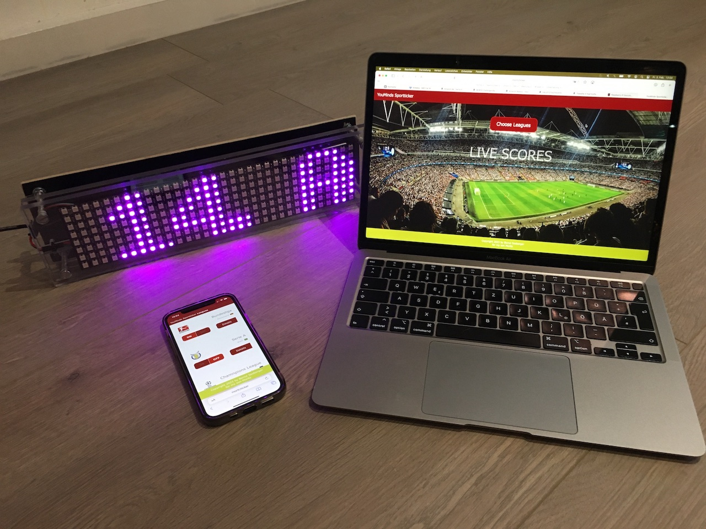

# Soccer  Ticker for Matrix LED Displays with Controlling APP




This ticker app retrieves scoccer data from https://www.football-data.org and displays scores and standings on a matrix LED display.

It is based upon a Raspberry Pi. I used a Revision 2 Model B with only one USB and a Edimax WLAN module. You may as well use other Raspberry Pi hardware.

The display is a 32x8 LED BTF-LIGHTING WS2812BECO from Amazon.

The application uses the following third party software:

- Raspberry Pi OS Lite 32 Bit from https://www.raspberrypi.com/software/
- JQ a JSON parser
- Lighttpd web server
- rpi-ws2812-server display driver service

Please make shure to read and accept the licence conditions of each third party prodcut.


## Hardware setup

### Parts
These are the parts that comprise the soccer ticker. Basically a Raspberry Pi with power adapter a WLAN Module and of course the Matrix display. The power adapter should have 2 Amps to run the display proberly.


### Display
I built a housing with acrylic panels.


### Wireing
The matrix display comes with 3 wires. 
```
Ground  (WHITE)
+5V     (RED)
Data In (GREEN)
```
The data in goes to **PIN 18** on the Raspberry.


## Software installation

- **Install the Pi OS**
  - Create a boot SD-Card with Raspberry Pi OS Lite 32 Bit from https://www.raspberrypi.com/software/
  - Connect a monitor, a dual USB hub and plug the keyboard and the edimax WLAN stick to the Raspberry Pi
  - Insert the SD-Card
  - Power the Raspberry Pi
  - Wait for the end of the setup process of the Raspberry Pi OS Lite 32
  - When asked enter exactly "pi" as user
  - When asked enter a passwort of your choice
  - Enter ``` sudo raspi-config ```
  - Activate WLAN
  - Activate SSH
  - Expand the filesystem
  - Set the hostname to your choice or use "sportticker"
  - Enter ```sudo reboot```
- **Access the Pi with SSH**
  - Check your router if Raspberry connected the WLAN
  - Open a terminal window on windows or iOS
  - Enter ```ssh pi@sportticker``` or ```ssh pi@[THE WLAN IP]"```
  - Enter your passwort
  - You may now switch off the Raspberry, disconnect the keyboard and the monitor, leave the WLAN stick and switch the raspberry on again.
- **Install the rpi-ws2812-server**
  - Log in again via terminal window and SSH
  - Go to https://github.com/tom-2015/rpi-ws2812-server and follow the instructions
  - Do not install the service
  - Make shure the LED Matrix data in is connected with pin 18
  - Test the display
  - Go to the rpi-ws2812-server directory
  - Start the display driver with ```sudo ./ws2812svr```
  - Enter
    ```
    setup 1,10,3 
    init 
    fill 1,006600 
    render
    ```
  - You should the the first 10 LEDs lighting
- **Install JQ**
  - Enter ```sudo apt-get install jq```
- **Install the ticker service**
  - Go to the home directory with ```cd $HOME```
  - Install the ticker with ```git clone https://github.com/youminds/youminds-sportticker.git```
  - Obtain an ID from https://www.football-data.org in order to use the soccer API.
  - In the $HOME directory create a file "fdid" with the ID using ```nano fdid```
  - Test the ticker 
  - Change into the youminds-sportticker directory 
  - Start the ticker with ```bash tickerloop.sh```
  - You should see the ticker running on the display
  - Interrput the ticker with CTRL+C
  - Install the ticker service with ```sudo bash tickerinstall.sh```
- **Configure the ticker service**
  - You may now configure the ticker by editing the configfiles in the /conf subdir
  - The syntax is: [LEAGUEID];[COLOR];[SPEED];[NAME];[MODE]
  - Where MODE is one of the following values: todayonly | todayorgameday | gamedayonly | gamedayorstandings
- **Or you may install the Web App for convenient configuration**
  - Install lighttpd with ```sudo apt-get install lighttpd```
    - Open a browser and type "http://sportticker" you should see lighttpd main page
    - Enable cgi with ```sudo lighty-enable-mod cgi```
    - Restart lighttpd with ```sudo service lighttpd force-reload```
  - Install the web app
    - Go to the directory /cgi-bin
    - Enter ```bash build.sh```
    - When the build finishes type "http://sportticker" again into a browser
    - You may now use the web application to configure the ticker
    - Changes will only take effect after the ticker has finished one round with all configured soccer data
- **HAVE FUN**
  

